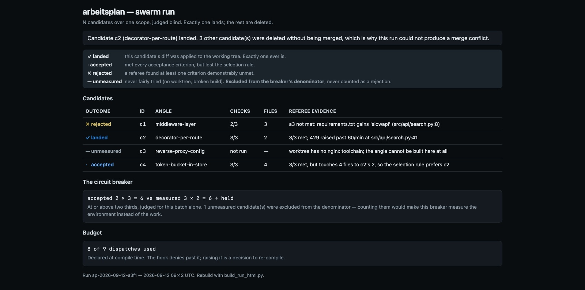

# arbeitsplan

**Compiles a stated problem into an executable, budgeted agentic workflow, runs it as a
redundant swarm, and lands exactly one adjudicated result.**

An *Arbeitsplan* is the routing sheet that turns a part drawing into a concrete sequence of
operations — which machine, which tooling, how long. That is this plugin's job: problem
drawing in, operation sequence out.

## Why this exists

Users are told to "use an agentic workflow" and don't. Not because they disagree — because
the advice carries no numbers. *How many agents? Which model? When does it stop?* This plugin
takes the transformation as its own job: in, a problem in prose; out, a spec concrete enough
that a machine runs it and a hook enforces it.

Two shapes that agentic advice usually takes are, on this repository's own evidence, traps.

**Serial validation does not converge.** `superpowers:subagent-driven-development` runs up to
five fix rounds per task, each one fix dispatch plus one re-review — up to ten dispatches
spent purely on validation — and then concedes the outcome itself: *"Past the cap, rounds
don't converge — the failure is structural."* It knows, and it still runs the loop five times
first. So here, convergence comes from **widening**, never from repeating: new independent
candidates under new angles. An identical re-dispatch is denied by a hook, not discouraged by
prose.

**One-agent-per-worktree buys conflicts.** The same skill states *"Never dispatch multiple
implementation subagents in parallel (conflicts)"*, which forbids parallelism *inside* a
worktree and forces it *up* to the worktree level — where the conflicts reappear at
integration, and cost more. This plugin uses the same isolation mechanism, inverted:

```
N worktrees, the SAME scope, one angle each
  c1 ✓ builds, tests pass, diff A
  c2 ✓ builds, tests pass, diff B
  c3 ✗ no toolchain → UNMEASURED, excluded from the denominator

referee (blind: criteria + diff only, never the builder's case)
  → c2 accepted

land c2. Delete c1 and c3, worktrees and branches.
```

Exactly one diff is ever applied, so **there is nothing to merge and a merge conflict cannot
occur**. Integration cost goes from O(N) conflicts to zero.

## What it is not

- **Not a reasoning aid.** A problem that turns out to be a *question* rather than a *change*
  is refused and routed to **`zirkel`**, with an `out-of-scope-reasoning` record — the
  boundary is implemented, not asserted. zirkel already does parallel branch generation,
  self-consistency voting and gated hybrid synthesis well; arbeitsplan does not reimplement
  any of it. zirkel reasons about a question; this compiles and executes a change.
- **Not the ordering runtime.** Ordering is **`takt`**'s charter — the beats span plugins, so
  no single plugin honestly owns that order. `arbeitsplan-compile` *writes* the beat
  declaration; takt enforces it. This plugin's own hook covers only per-dispatch attribution,
  which takt structurally cannot.
- **Not a proof engine.** **`andon`** proves a named wire with evidence. A referee here asks a
  narrower question: does this diff meet these criteria.
- **Not a code reviewer.** **`nacharbeit`**, **`lehre`** and **`cupertino`** each judge work
  against a standard. arbeitsplan judges candidates against each other and against the
  acceptance criteria the run declared.

## Install

```
/plugin marketplace add Anselmoo/werkstoff
/plugin install arbeitsplan@werkstoff
```

The hook is inert until a run is in flight (`analysis/arbeitsplan/run_scope.json`), so
installing it changes nothing until you compile a workflow.

<!-- rrt:auto:start:example-prompts-intro -->
## Example Prompts

Say any of these to Claude Code once the plugin is installed — they're plain-language
prompts, not exact phrasing Claude has to match. Claude routes them to the skill below
by intent.
<!-- rrt:auto:end:example-prompts-intro -->

##### Turn a vague piece of work into something runnable

````prompt
"I know roughly what I want to change but not how to actually run it as an agentic workflow — turn it into one"
````

> Triggers `arbeitsplan-compile`: scopes the problem, derives acceptance criteria with real
> commands, picks patterns from the frozen catalog, sets a dispatch budget, and writes
> `workflow.json`. Refuses and points at `zirkel` if the problem turns out to be a question.

##### Build several versions and keep the best one

````prompt
"build three independent versions of this change and land whichever one actually holds up"
````

> Triggers `arbeitsplan-run`: one worktree per candidate over the same scope, a blind referee
> per candidate, exactly one diff applied, the losers deleted. Nothing is merged.

##### Ask what shape the work should take

````prompt
"how many agents should I actually use for this, and when does it stop?"
````

> Triggers `arbeitsplan-patterns`: names a pattern, a fan-out width, a model tier, a stop rule
> and a cost, each tagged with whether the number was measured or reasoned.

##### Compare with and without a plugin, on fresh processes

````prompt
"run this same prompt three times with the plugin and three times without, on separate processes"
````

> Triggers `arbeitsplan-matrix`: compiles a `cases × models × plugin_states × repeats` sweep,
> proves the environment can authenticate with one cheap call, then runs it — one fresh
> process per cell, with a real per-cell `--model`.

##### Find out where to even start

````prompt
"which workflow fits fixing this bug, what do I need to install, and should I use plan mode?"
````

> Triggers `arbeitsplan-start`: matches the task to one of the four approved workflows in
> `references/approved-workflows.md`, names the plugins still missing with their exact
> install command, and states the permission mode to run in. Recommend-only — it never
> installs anything or writes `workflow.json` itself. "No fit" is a valid answer.

##### Decide how the work should run

````prompt
"should this run as a workflow of parallel agents, a matrix of fresh processes, or just in this session?"
````

> Triggers `arbeitsplan-backend`: walks the decision table in
> `references/backend-selection.md` and returns the `backend` object `workflow.json` needs —
> the kind, the table rows that chose it, and the acknowledged gap when it is `workflow`.
> Refuses `workflow` for any phase that writes the shared tree. Recommend-only.

##### Find out why something was refused

````prompt
"the swarm just stopped and said the contract is wrong — what happened?"
````

> Triggers `arbeitsplan-status`: reads the run's `run.jsonl` — phases closed and open, a halt
> with its reason, refuted candidates, open doubts, budget used, whether a lock is still open —
> and quotes the single next command.

## The two inversions

|  | the usual shape | here |
|---|---|---|
| converge by | **deepening** — retry the same scope until a reviewer passes it | **widening** — new independent candidates under new angles |
| parallelise by | **partition** — split the work, reconcile at the end | **redundancy** — same scope N times, keep one, delete the rest |
| unmeasured run | counted as a failure | **excluded from the denominator** |

That last row is the quiet one, and it is the invariant everything else rests on. A candidate
whose worktree would not build was never fairly tried. Counting it as a rejection makes the
circuit breaker measure the *weather* instead of the work — and in any design with a retry,
a weather reading is what starts the loop. This repository has derived the same rule three
times independently: `test/plugins/run.sh`'s `ERROR` ("a case whose error count is above zero
has no rate, only missing data"), matrize's `readable: false`, and quo-warranto's
`INDETERMINATE` ("not FAIL, because the case was never fairly measured").

## The circuit breaker

Judged **per batch, never cumulatively** — a cumulative rate lets healthy early batches mask
a batch that has started failing, and fires one full expensive batch too late.

| condition | meaning | response |
|---|---|---|
| `measured == 0` | nothing was built at all | **acquisition problem** — fix the environment, not the contract |
| `accepted × 3 < measured × 2` | under two thirds usable | **contract problem** — *the correct response is a better contract, not more agents* |
| no candidate accepted | all N failed the same way | **halt and surface** — never re-dispatch |

## The run directory is the plan of record

The plan is a file the compiler writes once; until this release the *execution* was a chat
transcript, so a halted run looked exactly like an abandoned one and no run could be resumed.
Now both live on disk, each written by code:

```
analysis/arbeitsplan/<runId>/
  workflow.json         the plan — immutable after compile         compile_spec.py
  run.jsonl             the execution — append-only, span-shaped   record_event.py, worktree_pool.py
  candidates/<id>.json  one file per candidate, written once       record_event.py
  referee/<id>.json     one file per verdict, written once         record_event.py
  phases/<id>.json      a plan-mode phase's output                 record_event.py
  landed.json           what landed, with divergedFrom if edited   land_candidate.py
  dispatch/<sha>.json   the re-dispatch ledger                     arbeitsplan_guard.py
```

`run.jsonl`'s events carry OpenTelemetry-GenAI-shaped ids (`trace_id`, `span_id`,
`parent_span_id`, `span`, `node_id`) with no OTel dependency, and a status from a closed set
— `proposed | accepted | refuted | doubt` plus lifecycle states. A losing candidate stays in
the record as `refuted`; a `doubt` must carry `resolves_if`. The writer is
`tools/run-record/run_record.py`, vendored here as `scripts/run_record.py`.

Three refusals make the record load-bearing rather than a log nobody writes:
`worktree_pool.py close` refuses a phase that recorded no terminal event (`--halt "<reason>"`
records one); a `Stop` hook refuses **one** completion while an armed phase is unrecorded; and
`reconcile.py` joins every acceptance id to recorded evidence, running each check itself with
`--run-checks` rather than trusting the referee's transcript.

## Measurement gates landing (#76)

`reconcile.py --run-checks` could always measure, but nothing in the operator's path *ran* it
before a landing — a builder's self-reported `checks: [{id, command, exit}]` went straight to
`land_candidate.py --apply` on trust. `reconcile.py --run <runId> --run-checks --candidate CID
--tree DIR`, run from the **main repository root**, closes that gap: it re-runs every checked
criterion of the run's acceptance with `cwd=DIR` — the candidate's own worktree, not the main
tree — and appends one `execute_tool` event per check to the run's `run.jsonl`, each carrying
`detail.candidate == CID`. Comparing that against `candidates/CID.json`, **by criterion id
only** — never by the builder's own command spelling — prints `CONTRADICTION <id>: ...`
(exit 1) for any disagreement, in either direction.

`land_candidate.py --apply` reads exactly those events as its landing gate: it refuses a
candidate lacking its **own** measurement (`detail.candidate` must equal that candidate — another
candidate's measurement never unlocks it) for any checked criterion, or whose *latest*
measurement contradicts its report, naming `reconcile.py` and `--run-checks` as the remedy. An
honestly-reported failure a referee already accepted is **not** blocked — the gate is "unmeasured
or contradicted", nothing more. Every refusal `land_candidate.py` makes is recorded in `run.jsonl`
too: an `execute_tool land_candidate` event, status `refuted`, `node_id` the candidate.

A contradiction is a **reported** exit that disagrees with the measured one, nothing else
(`land_candidate.contradicts()` is the one comparator both this gate and `reconcile.py`'s
`--candidate` mode call, so they cannot diverge). Two things are never a contradiction: the
builder's own spelling of a command (grouping is by criterion id, and the measured side always
uses the contract's own command), and a criterion the builder never reported at all (an empty
report carries no claim — the criterion still needs its own measurement, or it stays
**unmeasured**, never **contradicted**).

## Cleanup preserves dirty losers (#80)

Deleting a losing worktree used to be `git worktree remove --force`, unconditionally — a
rejected candidate's uncommitted state was simply gone, and the throwaway
`arbeitsplan/<runId>/<cid>` branch was never deleted at all. `worktree_pool.preserve_then_remove`
is now the **one** place under `scripts/` that calls `git worktree remove` (`sweep_artifacts.py`
imports it rather than shelling out a second copy): a DIRTY worktree (tracked changes, or
untracked non-ignored files) is committed in full and `kept/<runId>-<cid>` is pointed at that
commit **before** the worktree or its branch is removed; a clean worktree gets no `kept/` branch.
FAIL CLOSED — if preservation cannot write (a read-only object store, for instance), that
worktree and its branch are left exactly in place and `sweep_artifacts.py --apply` exits 1.
`sweep_artifacts.py` stays dry-run-by-default (a dry run now also names, per dirty worktree, the
`kept/` branch it would create and every candidate branch it would delete) and record-gated (a
run that has not ended keeps its worktrees and branches and gets no `kept/` branch either).

## Backends, and the plan-node stop

`backend` is an object — `{kind, why[], acknowledgedGaps[]}` — and `arbeitsplan-backend` picks
it from `references/backend-selection.md`. Under `workflow`, `workflows/run.js` executes
`spec.phases` itself, counts the dispatch budget in code (no hook sees a Workflow dispatch),
and **halts before every `mode: "plan"` phase** with `pending_plan_node`: with a run-scope
lock open, plan mode has no legal write. `worktree_pool.py open` refuses a plan-mode phase
for the same reason. The compiler refuses `workflow` for any phase that writes the shared
tree; candidates return diffs as data and the session lands one with `land_candidate.py`.

`scripts/test_run_workflow.js` executes `run.js` against stub hooks — no tokens — and then
sabotages it nine ways; each planted defect must turn the suite red.

## Hooks

A `PreToolUse` hook, `type: "command"`, matching `Skill|Task|Agent|Write|Edit|MultiEdit`, and
a `Stop` hook (below).
Never `type: "prompt"` — a prompt hook asks a model to decide, and a model asked whether it
may retry is the thing being governed.

It denies four things: an **identical re-dispatch**, a **write to the shared tree during a
fan-out**, a **write outside `writeScope`**, and a **dispatch past the declared budget**.

The re-dispatch ledger is the guard's **own**. A guard that checks a list some skill was
supposed to append to is a guard predicated on its own input existing — it fails open exactly
when the skill misbehaves, which is the case it was written for. So the hook records every
dispatch itself, one file per signature created with `O_CREAT|O_EXCL`: **a repeat dispatch is
that create failing with `EEXIST`**. No read-modify-write, no lock file, race-free across
parallel candidates by construction.

It gates on a **per-dispatch lock**, never on repo-level state. A guard in this repository
once gated on repo-level state and swept every edit in the session — from any plugin — into
its gate; parallel writers are exactly the case that breaks repo-level gating, and parallel
writers are this plugin's premise.

**Inert** unless `analysis/arbeitsplan/run_scope.json` exists. **Fail-closed** past that
point. **Python ≥ 3.11**, checked once a run is in flight: below it the guard denies naming
the version it found, instead of failing on the first 3.11-only call with a bare traceback.

The `Stop` hook refuses one completion while the armed phase has recorded no terminal event
in `run.jsonl`, naming the two legal moves. It never blocks twice — `stop_hook_active` allows
— so it cannot trap a session.

## The matrix backend

A second way to run a swarm: one fresh `claude -p` process per candidate instead of one
in-session dispatch. `cases × models × plugin_states × repeats` at **1 × 1 × 1 × N** *is* the
swarm, with isolation in-session dispatch cannot offer — a fresh registry, and a `--model`
that **cannot** be inherited from the caller.

Isolation is structural rather than enumerated: an empty temp cwd, `--setting-sources
project`, `--strict-mcp-config`, and `--plugin-dir` on the enabled arm only. Enumerating
everything currently installed goes stale silently; this does not.

Two traps it carries deliberately:

- **`--allowedTools` does not restrict the tool surface.** It is a *permission* allowlist.
  `--disallowedTools` restricts. A matrix that sets `allowed_tools` is **rejected** with that
  explanation rather than quietly honoured.
- **Denying is best-effort; the assertion is the gate.** The disallow list will go stale, so
  a cell that reached outside `expected_tools` is scored `UNMEASURED` — never `FAIL`, because
  the case was never fairly measured.

**Authentication is probed, not assumed.** An earlier version refused to run whenever it
detected a nested Claude Code session, on the strength of a measurement made in another
repository. That does not reproduce here, and the refusal was redundant anyway — a cell that
hits an auth banner is already `UNMEASURED` with the reason. The runner now makes one cheap
call first: if it authenticates the sweep runs, and if it does not the runner refuses **and
prints what the probe actually got**, which a blanket refusal never could. `--skip-probe`
bypasses it.

## Delegation, and why it does not replace takt

Every plugin declares what it **produces** and **requires** in
`.claude-plugin/beats.json`; `emit_beats.py --repo-only` compiles the union into one
`.claude/takt.local.md`, and takt enforces it. The repo's cross-plugin order becomes one
readable artifact instead of prose scattered across seven guards.

Delegation itself — who dispatched whom, how deep — is a different axis, recorded in an
append-only `delegation.jsonl` and bounded by **depth 3 plus cycle detection**, both in the
hook. The two rules catch different things: a cap bounds a runaway chain `A→B→C→D`, while
`A→B→A` is depth 2 and would sail under any cap. See
[`references/delegation.md`](references/delegation.md).

That is also why takt is not redundant: a delegation ledger cannot express *"no `*.tsx` write
until the council has run"* — there is no dispatch to record.

## Composing with takt

`arbeitsplan-compile` generates `.claude/takt.local.md`, and takt enforces it. That is why
ordering is absent from this plugin's own hook: two guards answering one question is two
answers that will drift.

Beats are namespaced by `runId`, so a marker from an earlier run cannot satisfy this run's
beat — takt gained an optional `runId` field for exactly this, and a declaration without one
behaves as it always did.

**Writing that file makes takt live and fail-closed in your repository**, so it is written
only behind an explicit approval gate. And if a declaration already exists without this
plugin's provenance key, `emit_beats.py` **refuses** rather than replacing it: takt reads only
the first fenced block, so there is no safe merge, and overwriting would silently switch off
rules somebody meant.

## The run report



```bash
python3 plugins/arbeitsplan/scripts/build_run_html.py --run <runId> --out /tmp/run.html
```

Rendered from committed demo data at `scripts/fixtures/run-demo.json`, so the picture is
reproducible rather than a snapshot of one machine. That fixture deliberately carries all four
outcomes — **landed**, **accepted**, **rejected** and **unmeasured** — because a demo missing
any of them cannot show what that state looks like, and `unmeasured` is the one a reader most
needs to see excluded from the breaker's denominator.

Every outcome is a word plus a glyph; colour is a third channel on top of two that already work
without it.

## Verifying a change to this plugin

```bash
python3 test/plugins/lint-frontmatter.py plugins/arbeitsplan
claude plugin validate plugins/arbeitsplan --strict
python3 plugins/nacharbeit/scripts/nacharbeit_lint.py plugins/arbeitsplan --docs-root docs
python3 plugins/arbeitsplan/hooks/test_arbeitsplan_guard.py
python3 test/plugins/verify-hooks-deny.py plugins/arbeitsplan
bash plugins/arbeitsplan/scripts/run_matrix.sh --selftest
python3 plugins/arbeitsplan/scripts/compile_spec.py --selftest
python3 plugins/arbeitsplan/scripts/emit_beats.py --selftest
python3 plugins/arbeitsplan/scripts/worktree_pool.py selftest
python3 plugins/arbeitsplan/scripts/land_candidate.py --selftest
python3 plugins/arbeitsplan/scripts/run_record.py selftest
python3 plugins/arbeitsplan/scripts/record_event.py selftest
python3 plugins/arbeitsplan/scripts/reconcile.py --selftest
python3 plugins/arbeitsplan/scripts/sample_rederive.py --selftest
python3 plugins/arbeitsplan/scripts/sweep_artifacts.py --selftest
python3 plugins/arbeitsplan/scripts/check_contract_sync.py --selftest
python3 plugins/arbeitsplan/hooks/test_record_stop_guard.py
node plugins/arbeitsplan/scripts/test_run_workflow.js
bash scripts/ci/check-js-syntax.sh
```

`node --check` is gone from this list on purpose. Under Node's module auto-detection,
`export const meta` makes it parse a workflow as an ES module, where the top-level `return`
every correct workflow carries is illegal — all fifteen failed under Node 26 without a file
changing. `check-js-syntax.sh` parses the body as the runtime does, as an async function.

`test_arbeitsplan_guard.py` is sabotage-tested, and the sabotages are worth running rather
than trusting — each is named in its docstring. Make `dispatch_signature` return a constant
and the `WIDEN` cases must go red; drop `O_EXCL` and `REPEAT` must; make `matches` return
`True` and `SCOPE` must. A guard whose test cannot fail reports success every run and nobody
looks again.

`run_matrix.sh --selftest` runs two end-to-end checks against a stub CLI, and they exist
because validation alone would have caught neither of the two bugs that shipped in the argv
builder during development: tab used as a field separator (an IFS *whitespace* character, so
the empty `plugin_dir` of the disabled arm collapsed and **swapped the two ablation arms**),
and `printf '%s'` without a trailing newline (so `read` hit EOF and the **enabled** arm got no
`--plugin-dir` at all). Both produced a full table of `PASS`es. An ablation whose arms are
wrong is worse than no ablation, because it reports a number.

## Escape hatch

`ARBEITSPLAN_DISABLE_GUARD=1` bypasses the guard, and it is named in every denial message.
Closing the run (`rm analysis/arbeitsplan/run_scope.json`) makes the hook inert again.

A denial from **another** plugin's guard is that plugin doing its job. Report it; do not reach
for its escape hatch.
