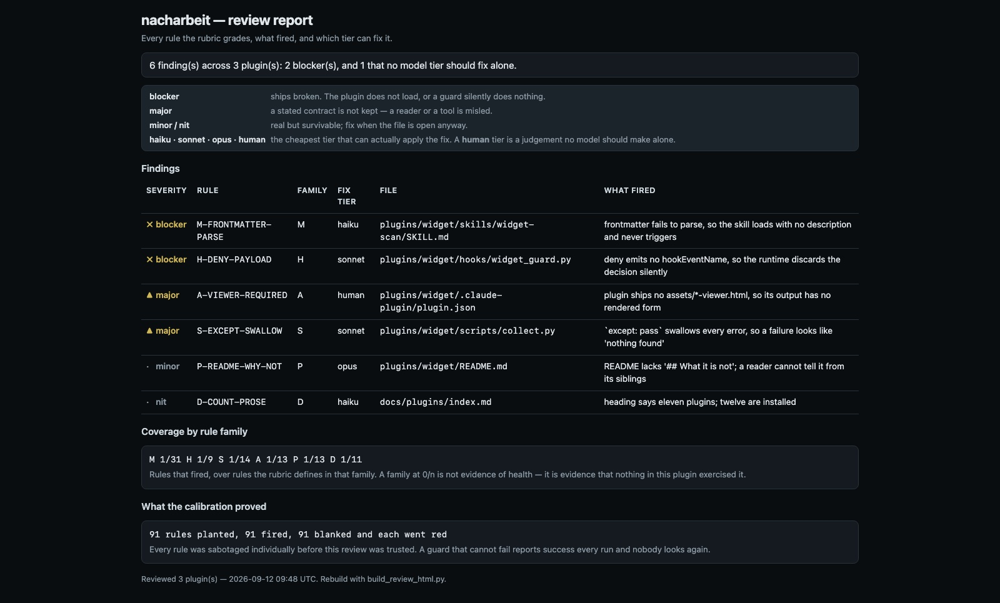

# nacharbeit

**Reworks a Claude Code plugin to the official Anthropic standard — the way a part
that failed inspection is reworked to spec, then measured again before it leaves the
bench.**

*Nacharbeit* is the manufacturing word for exactly that: rework of a part that did not
pass, back to the drawing. This plugin is the review that finds where a plugin's
skills, agents, commands, workflow prompts, hooks, scripts, report viewers, manifest,
README and developer docs fall short of the standard, and the fix pass that reworks the
mechanical and local-rewrite share of that — under a lock, blind-verified, and never
past the tier a model can apply without judgement it lacks.

## Why this exists

The instrument behind this plugin was built in
[PR #56](https://github.com/Anselmoo/werkstoff/pull/56) as repo-internal tooling: a
frozen rubric that settles the seven places official Anthropic guidance and third-party
sources disagree (official docs win), a sabotage-tested linter for the mechanical rules,
a review workflow whose sonnet finder must pass a planted-defect calibration and a
sealed hold-out before it grades a real file, and a fix workflow that applies only the
haiku and sonnet tiers with a blind verifier behind every edit. It reviewed the nine
plugins of this workshop, found 244 verified defects, and fixed 274 of 297 entries.

Three things were wrong with leaving it there. It could not be installed anywhere else.
It graded prose only — rubric decision F5 scoped hooks *out*, and scripts, viewers,
manifests, READMEs and the docs that wire a plugin in were never looked at, although
every one of them has shipped broken in this repo (a hooks.json whose deny the runtime
silently ignored, a plugin missing from the root README, a `.gitignore` line swallowing
a whole `scripts/lib/` package). And its fix pass edited other plugins' files with
nothing but prose telling it which ones — the one layer this repo has measured to hold
one run in three.

nacharbeit is that instrument as a plugin, with five more rule families, a PreToolUse
hook that turns the fix scope into a refusal, and every werkstoff-specific path behind a
flag with a werkstoff default.

## What it is not

- Not a design or code reviewer for the *application* a plugin is pointed at — that is
  `self-assess` (documented conventions, idioms), `lehre` (an enforced doctrine) and
  `codebase-consistency` (undocumented variants). nacharbeit's object is the plugin.
- Not `cupertino-handbook-check` / `cupertino-handbook-fix`, which check *new work*
  against a project's persisted handbook; nacharbeit checks a plugin against a fixed,
  externally sourced rubric.
- Not a proof that a fix is correct. Its verifier checks that an entry was applied and
  nothing regressed; whether the reworked skill *works* is `andon-verify`'s job, and the
  fix skill hands off there.
- Not a report viewer. The findings report is Markdown; a viewer would put nacharbeit
  under its own `A-*` rules on day one, and it can wait.

## Install

```
/plugin marketplace add Anselmoo/werkstoff
/plugin install nacharbeit@werkstoff
```

Or point Claude Code at the directory: `cc --plugin-dir /path/to/werkstoff/plugins/nacharbeit`.
The hook is inert until a fix pass opens `analysis/nacharbeit/fix_scope.json`, so
installing it changes nothing about an ordinary session.

## The seven surfaces and their rules

| surface | mechanical (script) | judgement (model) | what it delegates to |
|---|---|---|---|
| skills, agents, commands, workflow prompts, references | `M-*` (25) | `Q-*` (28) | — (PR #56's set, unchanged) |
| `hooks/hooks.json` and its guard scripts | `H-*` (14) | `HQ-*` (5) | `takt_guard.py`'s contract; `verify_hooks_deny.py` as a post-check |
| `scripts/**`, `hooks/*.py` | `S-*` (9) | `SQ-*` (4) | `ast`, `node --check`, `test/plugins/lint-oracles.sh`'s forms |
| `assets/*-viewer.html` | `A-*` (12) | `AQ-*` (4) | `scripts/ci/check_viewer_conformance.py` (vendored) for the six codes CI decides; the editorial rules it refuses go to the finder |
| `plugin.json`, `README.md`, `CHANGELOG.md` | `P-*` (19) | `PQ-*` (5) | `lint-plugin-authors.py`, `build_prompt_index.py`'s scan, `rrt docs inject` |
| repo docs wiring (`docs/`, root README, CLAUDE.md, orchestration references) | `D-*` (11) | `DQ-*` (2) | the docs generators; `validate_catalog.py` |

Every rule, its severity and its source page is in [`references/rubric.md`](references/rubric.md).
The linter plants one defect per mechanical rule and blanks each rule in turn to prove
it load-bearing (`scripts/test_nacharbeit_lint.py`); the finder is calibrated per
family against `test/plugins/fixtures/nacharbeit/` and refuses to grade a family whose
sealed recall falls below its floor.

## Skills

| skill | role | what it does |
|---|---|---|
| `nacharbeit-preflight` | leaf, read-only | inventory by kind, available checkers, other live guards, open lock |
| `nacharbeit-lint` | leaf, zero tokens | the calibration, then the 90 mechanical rules |
| `nacharbeit-review` | orchestrator | build and bake args → calibrated workflow → persist → report |
| `nacharbeit-fix` | orchestrator | open the lock and snapshot → remediate / verify / repair per file → post-checks and contract diff → release |
| `nacharbeit-status` | status | what ran, what is held for a person, whether a lock is open |

Two agents exist for sessions without the Workflow tool: `component-finder` grades one
batch for one lens and labels its result **uncalibrated** (the fix pass refuses such a
run); `fix-verifier` blind-verifies one file and runs its post-checks.

<!-- rrt:auto:start:example-prompts-intro -->
## Example Prompts

Say any of these to Claude Code once the plugin is installed — they're plain-language
prompts, not exact phrasing Claude has to match. Claude routes them to the skill below
by intent.
<!-- rrt:auto:end:example-prompts-intro -->

##### See what a review would measure here

````prompt
"what would nacharbeit check in this repo, and is anything blocking a run?"
````

> Triggers `nacharbeit-preflight`: units per plugin by kind, which checkers exist,
> which other guards are live, and whether a fix lock is open.

##### Lint a plugin against the standard, for free

````prompt
"lint plugins/lehre against the Anthropic plugin standard — frontmatter, hooks.json, scripts, the README"
````

> Triggers `nacharbeit-lint`: the sabotage calibration first, then the 90 mechanical
> rules; findings by rule and file, nothing applied.

##### Run the calibrated review

````prompt
"review our plugins against the nacharbeit rubric and give me the backlog by model tier"
````

> Triggers `nacharbeit-review`: calibration per family, sealed hold-out, two-lens finders,
> routing simulation, refuter, opus synthesis, and the findings report.

##### Apply what a model can apply, under the lock

````prompt
"apply the haiku and sonnet findings from the review, one file at a time, and tell me what's left for me"
````

> Triggers `nacharbeit-fix`: the lock opens, the guard denies everything outside it,
> each file is reworked and blind-verified, the opus and human entries are listed for you.

##### Find out what is waiting on a person

````prompt
"nacharbeit status — which findings need a human, and is a fix pass still open?"
````

> Triggers `nacharbeit-status`: the last run, the held entries verbatim, and a stale lock
> with its release command.

## Hooks

One `PreToolUse` hook, `type: "command"`, matching `Write|Edit|MultiEdit|Bash`. Never
`type: "prompt"` — a prompt hook asks a model to decide, which is the model-mediated
path this plugin exists to replace.

- **Inert** when `analysis/nacharbeit/fix_scope.json` is absent: the call is allowed
  before it is even inspected. `NACHARBEIT_STATE_DIR` relocates the lock.
- **While the lock is open**, denies a `Write`/`Edit`/`MultiEdit` whose target is not
  in the lock or cannot be determined, an edit to a file the lock lists as opus- or
  human-tier, and a `Bash` command that changes git state (`git commit|push|reset|…`,
  `gh pr create|merge`). Writes under the state directory are always allowed.
- **Fail-closed** once the lock exists: a malformed lock or any internal error denies,
  naming the escape hatch. A stale lock therefore denies, which is the safe direction.
- **Why a lock and not repo state**: a PreToolUse payload carries no field saying
  which agent issued the edit, so a guard that gated on "this repo is mid-review" would
  sweep every edit in the session into the gate — the failure
  [`docs/orchestration/references/hazards.md`](../../docs/orchestration/references/hazards.md)
  records for self-assess. The lock's fields and lifecycle are in
  [`references/fix-scope-schema.md`](references/fix-scope-schema.md).

## Running it outside werkstoff

Every werkstoff-specific location is a flag: `--plugins-root`, `--state-dir`,
`--fixtures-root`, `--known-answers` (a prompt index for the routing simulation;
without one, collisions are labelled hints), `--ambiguous`, `--docs-root`,
`--marketplace`, `--write-roots`, `--artifact-copies`, `--repo-name` and
`--repo-notes`. `build_report.py --no-vitepress` writes plain Markdown. The fixtures
under `test/plugins/fixtures/nacharbeit/` travel with the repository, not the plugin;
another repository copies them (or its own, in the same `planted.json` shape) and
points `--fixtures-root` at them — the review refuses to grade a kind it has no
tuning + sealed pair for.

## The review report



```bash
python3 plugins/nacharbeit/scripts/nacharbeit_lint.py plugins/* --docs-root docs --json > /tmp/review.json
python3 plugins/nacharbeit/scripts/build_review_html.py --report /tmp/review.json --out /tmp/review.html
```

Rendered from committed demo data at `scripts/fixtures/review-demo.json`. The fixture carries a
**blocker** and a **human**-tier finding on purpose: the tier column exists to separate what a
model can close from what is a judgement call, and a demo without one cannot show that.

The page also states plainly that a family at `0/n` is **not** evidence of health — it is
evidence that nothing in the reviewed plugin exercised that family.

## Verifying a change to this plugin

```bash
python3 plugins/nacharbeit/scripts/test_nacharbeit_lint.py     # the linter asserts itself: 90 rules planted, blanked, synced
python3 plugins/nacharbeit/hooks/test_nacharbeit_guard.py      # the hook denies AND allows, 24 cases
python3 plugins/nacharbeit/scripts/nacharbeit_lint.py plugins/nacharbeit --docs-root docs   # the plugin lints clean under its own rules
python3 test/plugins/lint-frontmatter.py plugins/nacharbeit
python3 test/plugins/verify-hooks-deny.py plugins/nacharbeit
node --check plugins/nacharbeit/workflows/review.js && node --check plugins/nacharbeit/workflows/fix.js
claude plugin validate plugins/nacharbeit --strict
python3 plugins/nacharbeit/scripts/build_args.py               # bakes analysis/nacharbeit/run.js without launching it
```

Measurement history, kept because the corrections matter more than the numbers:

- `nacharbeit-lint-hooks-shape`'s first real run scored PASS on a transcript that opened
  "I couldn't run the actual scripts here". Under root, `run.sh`'s `acceptEdits` fallback
  denied every Bash call, the model hand-read the guard, and happened to name the right
  rule. The tally said pass; the transcript said luck. `run.sh` now grants the
  interpreters in the clean box under root, and the oracle rejects the admission itself
  (recorded in `cases.tsv` and as a must-FAIL case in the calibration script).

`test_nacharbeit_lint.py` runs first because an instrument must prove it can fail before
its silence means anything. Its first run against the ten plugins caught three rules
that matched themselves — a `shell=True` regex flagged the linter's own pattern, the
`\b!==` check flagged its own table, and a viewer rule flagged a constant error string
as an injection surface — each tightened before a single real finding was believed.

### Behavioural cases

Four cases in `test/plugins/cases.tsv` exercise the model-mediated half. The hook is
not among them: it is deterministic and covered by the two scripts above.

```bash
bash test/plugins/calibrate-nacharbeit-oracles.sh   # ALWAYS first
bash test/plugins/verify-clean-box.sh
bash test/plugins/run.sh nacharbeit-lint-hooks-shape
```

| case | seeded defect |
|---|---|
| `nacharbeit-lint-hooks-shape` | a hooks.json whose guard emits `systemMessage` — a deny the runtime ignores; its anti-pattern rejects a transcript that admits it never ran the linter |
| `nacharbeit-preflight-inventory` | a plugin with a hook, a viewer and no `node`-free way to check its workflow; the report must name what it cannot measure |
| `nacharbeit-status-stale-lock` | a two-day-old `fix_scope.json`; the answer must lead with the release command |
| `nacharbeit-fix-refuses-uncompleted` | a `run.json` with `completed: false`; nothing may be applied |

## Escape hatch

`NACHARBEIT_DISABLE_GUARD=1` bypasses the guard for one call. It is deliberately
visible and deliberately total. The intended way out of a denial is to finish the pass
and release the lock with `python3 plugins/nacharbeit/scripts/post_fix_check.py
--release-lock`; the intended way past an opus- or human-tier entry is a person
deciding it.
