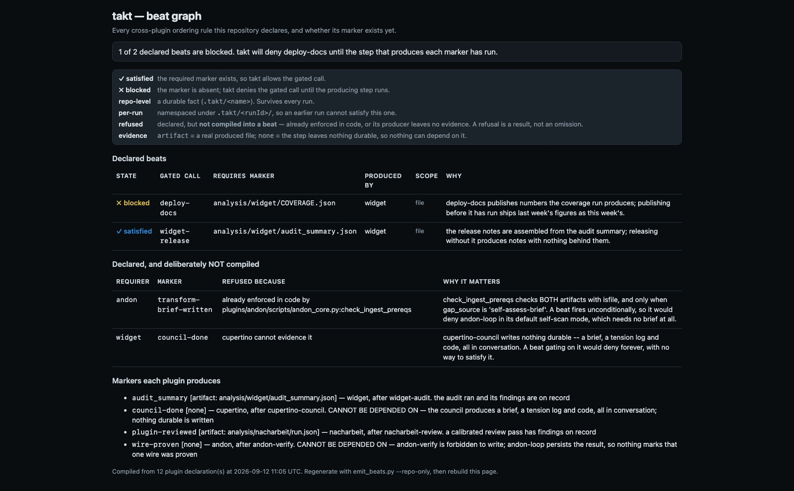

# takt

**Enforces declared beat order at the tool-call layer, so sequencing is a gate rather
than a sentence.**

## Why this exists

Several skills in this marketplace already declare where in a build they belong.
`cupertino-council` says to use it "at UI/frontend build-time, before writing any code
... Always run before code, never after — retrofitting the council onto finished code
defeats the purpose." `cupertino-backwards` says "Use FIRST." `compass-clarify-scope`
scopes a task "before any work begins."

Nothing enforces any of it. A declaration written as prose is a sentence a model may
skip under load, and this repository has measured what that costs: a rule stated as
prose in a SKILL.md is the baseline, a guard behind a fenced `python3` block is invoked
about one run in three, and a `PreToolUse` hook of `type: "command"` blocks on the first
attempt. takt is the difference between a documented beat order and an enforced one.

It owns no skills and no agents. It is one hook and a declaration format, because the
beats it enforces span plugins — a council from one, an audit from another, a proof from
a third — and no single plugin honestly owns that order.

## What it is not

takt is **not** a planner. It enforces an order somebody else decided; it never decides
one, and it ships no skills and no agents on purpose — the beats it enforces span
plugins, so no single plugin honestly owns that order.

- **`arbeitsplan`** compiles a problem into a workflow and *writes* the beat declaration
  takt then enforces. If you want the beats authored for you, that is the plugin; takt is
  the runtime underneath it.
- **`compass`** reasons about what to do. takt has no opinion about whether an order is
  wise, only about whether it was followed.
- **`andon`** proves a wire is actually proven. takt only asks whether a marker exists —
  it never inspects what the marker claims.
- **`nacharbeit`**, **`lehre`**, **`cupertino`** each gate their own domain's rules. takt
  gates the order *between* them, which is the only thing none of them can see.

takt also never writes a file, including the markers themselves. Whatever performs a beat
creates its marker; takt reads and refuses, nothing else.

## Install

```
/plugin marketplace add Anselmoo/werkstoff
/plugin install takt@werkstoff
```

takt is inert until a repository declares its beats, so installing it changes nothing
until `.claude/takt.local.md` exists.

## Declaring beats

Create `.claude/takt.local.md` with one fenced `json` block:

````markdown
```json
{
  "beats": [
    {
      "id": "ui-before-council",
      "tools": ["Write", "Edit", "MultiEdit"],
      "paths": ["*.tsx", "*.jsx", "*.vue", "*.svelte", "src/ui/*"],
      "require": ".takt/council-done",
      "reason": "cupertino-council runs before UI code, never after."
    }
  ]
}
```
````

| Field | Meaning |
|---|---|
| `id` | Name reported in the denial |
| `tools` | Tool names the beat applies to; defaults to `Write`, `Edit`, `MultiEdit` |
| `paths` | `fnmatch` globs matched against the edited file, for the edit tools |
| `skills` | `fnmatch` globs matched against the dispatched name, for `Skill`/`Task`/`Agent` |
| `require` | Marker path that must exist before the call is allowed |
| `reason` | Sentence included in the denial, explaining the order |

Whatever performs the beat creates the marker — `mkdir -p .takt && touch
.takt/council-done`. takt never writes files; it only reads and refuses.

### `runId` — for a declaration that describes one run

A marker is an existence check, so by default it is permanent: once
`.takt/council-done` exists it satisfies its beat forever. That is right for a durable
project fact ("the design council has run for this UI"), and wrong for a declaration
that describes a single run — a marker left by last week's run would satisfy today's
beat, and the gate would pass without the step ever happening.

An optional top-level `runId` namespaces every **relative** marker under
`.takt/<runId>/`:

````markdown
```json
{
  "runId": "ap-2026-09-12-a3f1",
  "beats": [
    {
      "id": "land-after-referee",
      "tools": ["Skill", "Task", "Agent"],
      "skills": ["arbeitsplan-run"],
      "require": "refereed",
      "reason": "candidates are refereed before one is landed."
    }
  ]
}
```
````

- **Omit it and nothing changes.** A declaration with no `runId` resolves markers
  exactly as before; this is the case every existing declaration is in, and
  `hooks/test_takt_guard.py` pins it under the name `BACKWARD`.
- A new `runId` invalidates every earlier run's markers at once, because they live in a
  different directory. Staleness stops being a thing to remember.
- `runId` becomes a path component, so it must match `[A-Za-z0-9._-]{1,64}` and contain
  no `..`. Anything else **denies** rather than being sanitised — sanitising a path
  invites a bypass.
- An **absolute** `require` is always taken literally, `runId` or not. An explicit path
  is an explicit path.

Generated declarations are the reason this exists: `arbeitsplan` compiles beats from a
workflow spec, and a generator that reused one run's markers in the next run would
produce a file that looks enforced and enforces nothing.

A single call can touch several files: a `MultiEdit` may carry its paths in an `edits`
array rather than one top-level `file_path`. Every path a payload exposes is collected,
and a beat is violated if **any** of them is gated.

Matching is `fnmatch`, never regex. Every silent-failure regex form this repository has
been burned by is a regex-only failure mode that a glob cannot express.

<!-- rrt:auto:start:example-prompts-intro -->
## Example Prompts

Say any of these to Claude Code once the plugin is installed — they're plain-language
prompts, not exact phrasing Claude has to match. Claude routes them to the skill below
by intent.
<!-- rrt:auto:end:example-prompts-intro -->

##### Declare the beats for a repository

````prompt
"set up takt so UI code can't be written before the design council has run"
````

> Writes a `.claude/takt.local.md` beat with the UI globs and a `require` marker, after
> which the hook refuses a matching edit until that marker exists.

##### Understand a refusal

````prompt
"takt just blocked my edit — what beat am I running ahead of?"
````

> The denial names the beat id, the reason, and the missing marker; the escape hatch is
> `TAKT_DISABLE_GUARD=1` when the order genuinely does not apply.

## Hooks

One `PreToolUse` hook, `type: "command"`, matching
`Skill|Task|Agent|Write|Edit|MultiEdit`. Never `type: "prompt"` — a prompt hook asks a
model to decide, which is the model-mediated path this plugin exists to replace.

- **Inert** when `.claude/takt.local.md` is absent: the call is allowed before it is
  even inspected.
- **Fail-closed** once that file exists: any internal error denies rather than silently
  allowing, naming the escape hatch. So does an *indeterminate* payload — if a beat gates
  the call but no file path (or, for a dispatch, no skill or agent name) can be
  determined from it, takt refuses. A call that cannot be checked against a gate the
  repository opted into is precisely the bypass this plugin exists to prevent.
- **Escape hatch**: `TAKT_DISABLE_GUARD=1`, or remove the declaration file.

## The beat graph

takt enforces an order it never authors, and until now the only way to learn what it was
blocking was to trip over a denial. `assets/beatgraph-viewer.html` renders that order: every
declared beat, whether its marker exists yet, and which plugin produces it.



```bash
python3 plugins/takt/scripts/build_beatgraph_html.py --repo . --out /tmp/beatgraph.html
```

The screenshot above is rendered from committed demo data at
`scripts/fixtures/beatgraph-demo.json`, so it is reproducible rather than a picture of one
machine on one day. That fixture is **synthetic and says so**, and deliberately carries every state the page can
render: a blocked beat, a satisfied one, two refusals, and both evidence kinds. A demo missing a
state cannot show what that state looks like.

It is synthetic because this repository's own live graph currently compiles **zero** beats —
every cross-plugin ordering rule here is either already enforced in code or has a producer that
leaves no evidence. `build_beatgraph_html.py --repo .` renders that real state, and the page
says plainly that no beats is a *result*, not an omission.

The beat list is the **compiler's**, imported from `arbeitsplan/scripts/emit_beats.py` rather
than re-derived — the selftest asserts the two counts match. A page and a compiler that
disagree about what is enforced is a page that lies, and this repo has already been burned once
by a validator that drifted from the guard it validated.

State is carried by the word and the glyph; colour is a third channel on top of two that already
work without it.

## Testing

```bash
python3 plugins/takt/hooks/test_takt_guard.py          # denies AND allows; BACKWARD + STALE
python3 plugins/takt/scripts/validate_beats.py --selftest
python3 test/plugins/verify-hooks-deny.py plugins/takt
python3 test/plugins/verify-takt-payload-shapes.py
```

`test_takt_guard.py` is sabotage-tested, and the sabotage is worth running rather than
trusting: make `marker_path_for` ignore `run_id` and the `STALE` cases must go red while
every `BACKWARD` case stays green. An earlier draft of those cases stayed green under
that sabotage — they were passing for the wrong reason, because a bare `require` resolved
to a path nothing had created. Planting the stale marker at *every* location an earlier
run could have left one is what makes them real.

`validate_beats.py` reports what the guard tolerates. The guard silently skips a beat
that gates nothing, which is correct at runtime — refusing every other beat because one
is malformed would be worse — and dangerous at authoring time, especially now that
declarations can be generated.

The fixture at `test/plugins/fixtures/hook-violation-takt/` is plugin-specific because
takt is scope-conditional: probed with the generic fixture the hook correctly allows,
which the harness would otherwise report as a hook that does nothing.

## Related

For which beats are worth declaring, and where each plugin belongs in a build, see
[`docs/orchestration/README.md`](../../docs/orchestration/README.md) and
[`docs/orchestration/references/claude-md-block.md`](../../docs/orchestration/references/claude-md-block.md).
